# SOC-Detection-Lab
SOC Detection Lab using Wazuh and Suricata

A Security Operations Center (SOC) home lab built using **Wazuh**, **Suricata**, **Docker**, and **Fedora Linux** to simulate real-world attacks, monitor security events, and investigate alerts through a centralized SIEM dashboard.

The lab demonstrates host-based and network-based threat detection by simulating attacks such as SSH brute-force attempts, network reconnaissance, and user account creation while visualizing alerts through the Wazuh Dashboard.

---

## Project Overview

This project was built to gain hands-on experience with modern SOC operations and blue team workflows.

The lab consists of:

- Wazuh Manager
- Wazuh Dashboard
- Wazuh Indexer
- Wazuh Agent
- Suricata IDS
- Fedora Linux endpoint
- Kali Linux attacker machine

Attack simulations were performed from Kali Linux while Wazuh and Suricata monitored, correlated, and generated alerts in real time.

---

## Architecture

                 Kali Linux
              (Attacker Machine)
                     │
        ┌────────────┼─────────────┐
        │            │             │
      Nmap         Hydra       SSH Login
        │            │             │
        ▼            ▼             ▼
           Fedora Linux Endpoint
        ┌─────────────────────────────┐
        │                             │
        │   Wazuh Agent               │
        │   Suricata IDS              │
        │   SSH Service               │
        │   System Logs               │
        └──────────────┬──────────────┘
                       │
               Security Events
                       │
                       ▼
            Wazuh Manager (Docker)
                       │
                       ▼
              Wazuh Dashboard

              ---

## Technologies Used

| Technology | Purpose |
|------------|---------|
| Wazuh | SIEM & HIDS |
| Suricata | Network Intrusion Detection |
| Docker | Wazuh deployment |
| Fedora Linux | Monitored endpoint |
| Kali Linux | Attacker machine |
| Nmap | Network reconnaissance |
| Hydra | SSH brute-force simulation |
| SSH | Remote authentication |
| Linux Audit Logs | Host monitoring |

---

## Features

- Centralized log collection
- Endpoint monitoring
- SSH authentication monitoring
- SSH brute-force detection
- Network reconnaissance detection
- User account creation monitoring
- Threat hunting using Wazuh Dashboard
- Suricata IDS integration
- Docker-based deployment

---

# Lab Setup

## 1. Deploy Wazuh using Docker

- Wazuh Manager
- Wazuh Dashboard
- Wazuh Indexer

### Screenshot

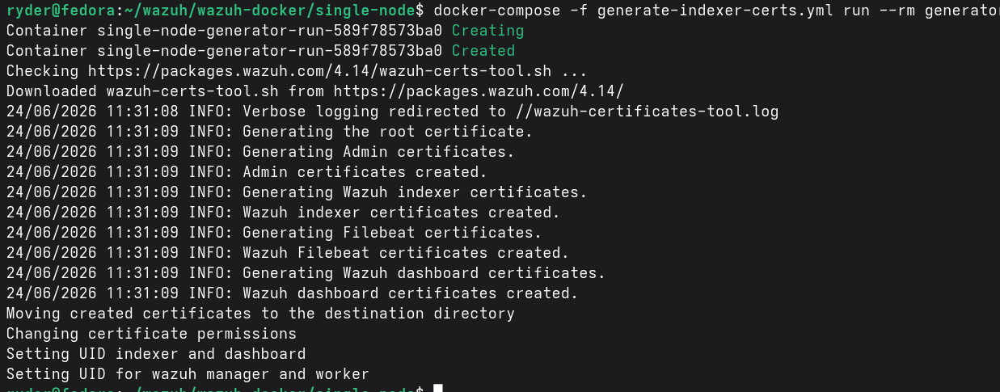

---

## 2. Login to Wazuh Dashboard

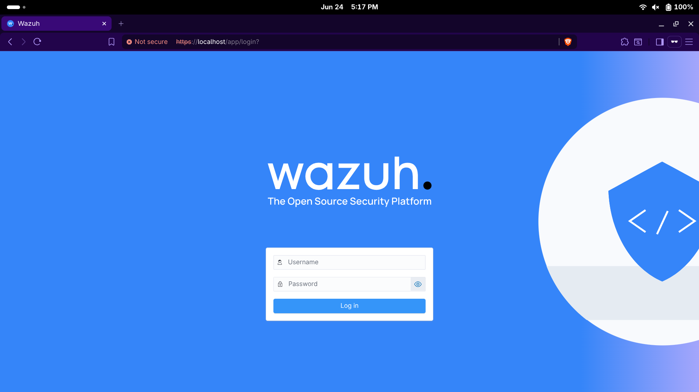

---

## 3. Dashboard Overview

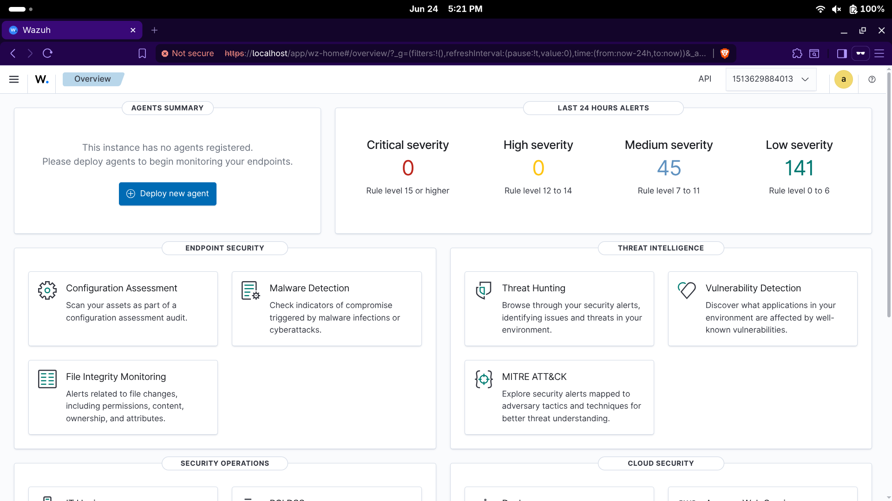

---

## 4. Register Fedora Agent

The Fedora endpoint was enrolled into Wazuh Manager for centralized monitoring.

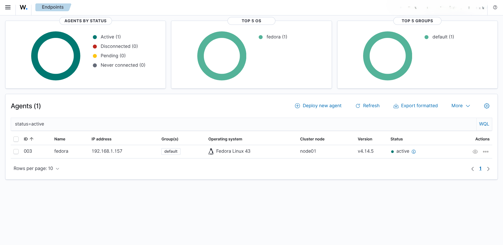

---

## 5. Endpoint Information

After enrollment, Wazuh collected inventory information including:

- Operating System
- CPU
- Memory
- Agent Status
- Compliance Data

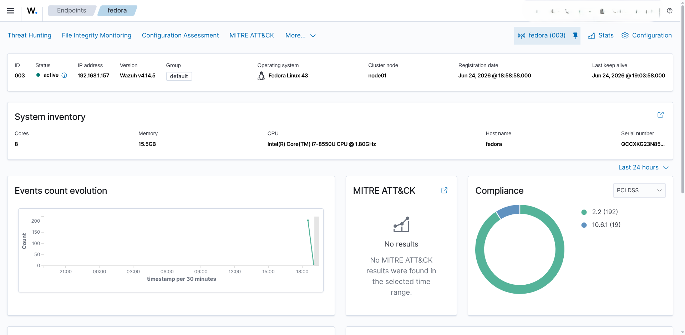

---

# Attack Simulations

## 1. Failed SSH Login Detection

Incorrect SSH credentials were intentionally entered multiple times.

### Attack

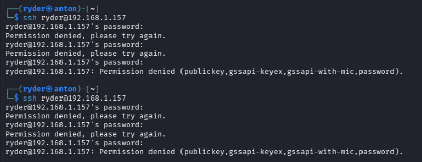

### Detection

Wazuh generated authentication failure events from sshd.

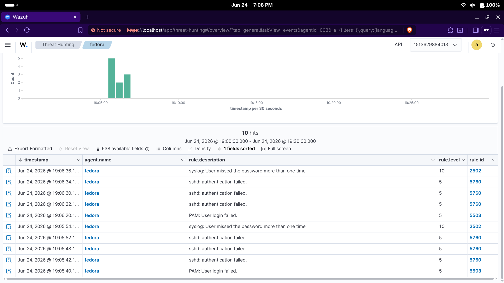

---

## 2. User Creation Detection

A new Linux user was created using:

```bash
sudo useradd testuser123
```

### Attack

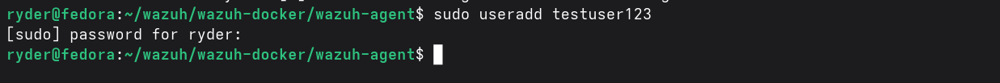

### Detection

Wazuh detected the creation of a new Linux user account and generated security events indicating both the new group and new user creation.

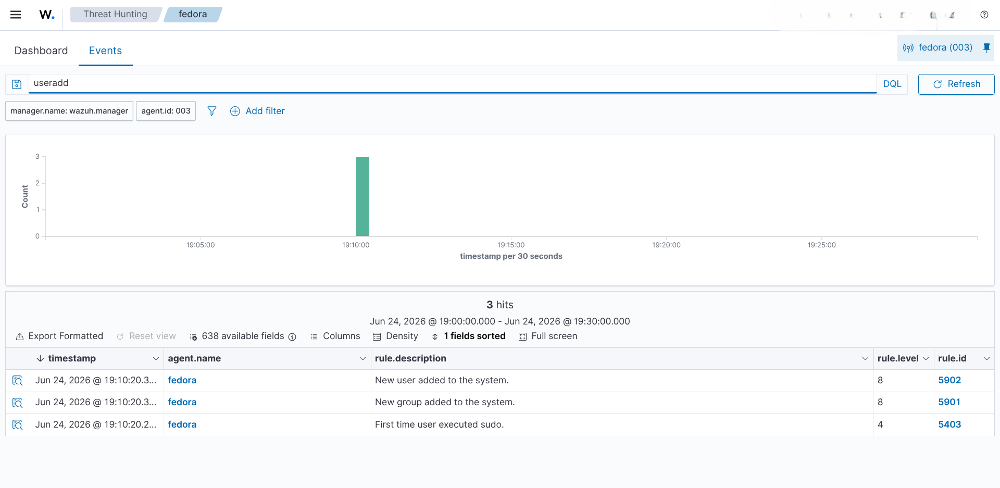

---

# Attack Simulations

## 3. Network Reconnaissance Detection

To simulate reconnaissance activity, an Nmap service and version detection scan was performed against the Fedora endpoint.

### Attack

```bash
nmap -A 192.168.1.157
```

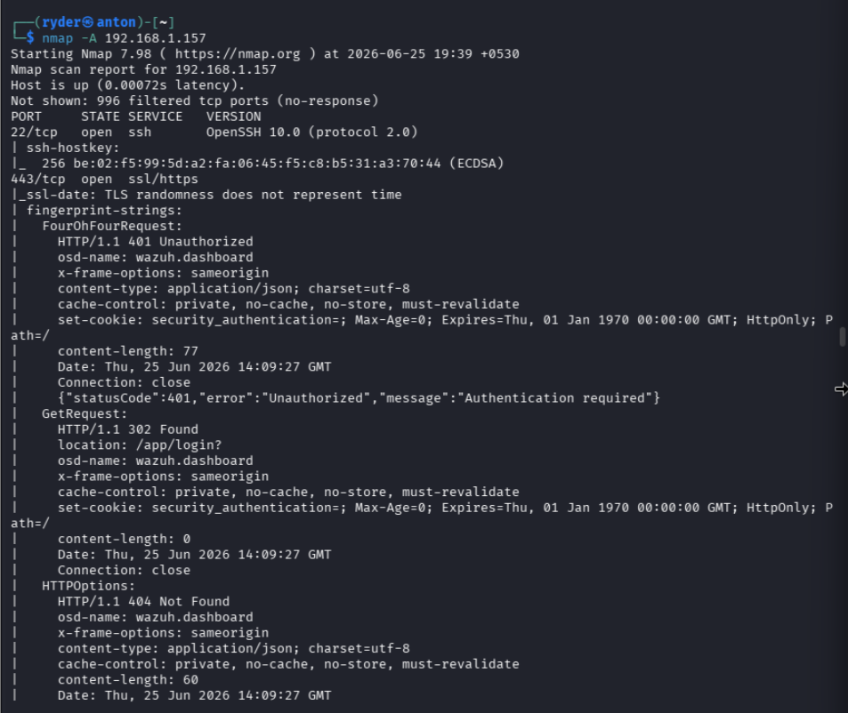

### Detection

Suricata identified the Nmap scan based on Emerging Threats (ET) signatures and forwarded the alerts to Wazuh, where they were centralized for investigation.

Detected events included:

- ET SCAN Possible Nmap User-Agent Observed
- HTTP protocol anomalies generated during the scan

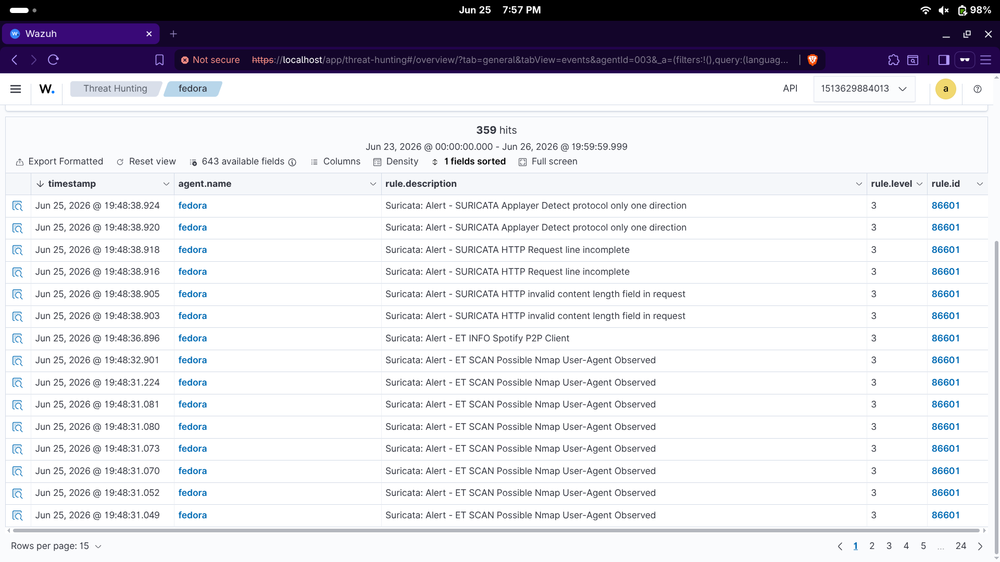

---

## 4. SSH Brute Force Detection

Hydra was used to simulate an SSH brute-force attack against the Fedora endpoint using a password wordlist.

### Attack

Example command:

```bash
hydra -l ryder -P passwords.txt ssh://192.168.1.157
```

The password list intentionally contained multiple incorrect passwords to generate authentication failures.

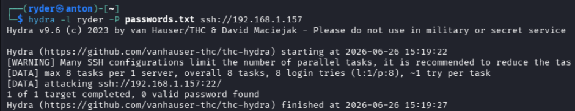

### Detection

Wazuh successfully detected multiple failed SSH authentication attempts and correlated them into a brute-force attack alert.

Alerts generated included:

- SSH authentication failed
- SSH brute force trying to get access to the system

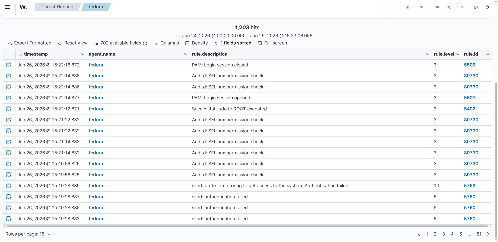

---

# Detection Summary

| Attack Simulation | Detection Source | Result |
|-------------------|------------------|--------|
| Failed SSH Login | Wazuh Agent | Detected |
| SSH Brute Force (Hydra) | Wazuh | Detected |
| User Account Creation | Wazuh | Detected |
| Nmap Reconnaissance | Suricata + Wazuh | Detected |

---

# MITRE ATT&CK Mapping

| Attack | MITRE Technique | Description |
|---------|-----------------|-------------|
| Nmap Reconnaissance | T1595 - Active Scanning | Service and version enumeration |
| SSH Brute Force | T1110 - Brute Force | Password guessing attack |
| Failed SSH Authentication | T1110.001 - Password Guessing | Repeated failed login attempts |
| User Account Creation | T1136 - Create Account | Local user account creation |

---

# Skills Demonstrated

- Security Operations (SOC)
- Threat Hunting
- Security Information and Event Management (SIEM)
- Host-based Intrusion Detection (HIDS)
- Network Intrusion Detection (NIDS)
- Linux Administration
- SSH Security Monitoring
- Log Analysis
- Attack Simulation
- Docker Deployment
- Wazuh
- Suricata
- Nmap
- Hydra

---

# Challenges Encountered

During development, several practical challenges were encountered and resolved:

- Configuring communication between the Wazuh Manager and Fedora agent.
- Setting up Suricata to forward alerts to Wazuh.
- Troubleshooting VirtualBox networking (NAT and Bridged Adapter configurations).
- Understanding how Wazuh correlates multiple authentication failures into brute-force alerts.
- Investigating why successful Hydra logins do not always generate separate "successful brute-force" alerts without additional correlation rules.

These troubleshooting steps provided valuable experience in real-world SOC deployment and security monitoring.

---

# Future Improvements

Planned enhancements for this lab include:

- Custom Wazuh detection rules
- Active Response to automatically block attackers
- Reverse shell detection
- Malware detection
- Sysmon integration
- Email and Slack alerting
- Multiple monitored endpoints
- Threat intelligence integration
- Dashboard customization

---

# Learning Outcomes

This project provided hands-on experience with:

- Deploying an enterprise SIEM using Docker
- Registering and managing monitored endpoints
- Configuring endpoint monitoring with Wazuh Agents
- Integrating Suricata IDS with Wazuh
- Simulating common cyber attacks
- Investigating alerts using Threat Hunting
- Correlating host-based and network-based events
- Understanding SOC monitoring workflows
- Working with Linux security logs
- Performing blue team analysis using open-source security tools

---

# References

- https://documentation.wazuh.com/
- https://suricata.io/
- https://www.kali.org/tools/hydra/
- https://nmap.org/
- https://attack.mitre.org/

---

## Author

**Vishwajeet Roy**

Cybersecurity Student | SOC & Blue Team Enthusiast
